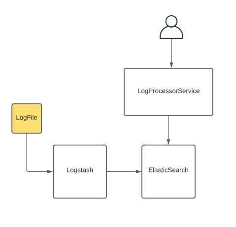

## Log Processor API


- Ingest log from logfile by LOGSTASH
- All logs are indexed in elasticSearch
- Expose endpoints to get business info from logs


### FEATURES

- Top 5 most used resources
- Top 5 most used resources by country
- Most and least used pages by date
- Most popular date
- HealthCheck endpoint

You can check swagger on:

```http://localhost:8080/swagger-ui/#/```


### HOW TO RUN
In order to start processing and expose log information you need to first start logstash and elasticsearch by running:

```docker-compose up```

Once you are all set you can build this project:

```./gradlew clean build```

Then execute the jar file like so:

```java -jar build/libs/processor-0.0.1-SNAPSHOT.jar```

### TECH DEBTS:

 - Remove group and sorting in memory on the getTopPagesByDate;


### NOT IMPLEMENTED FEATURES:
 - Security
 - Page ranking missing actions per page

### ARCH OVERVIEW
